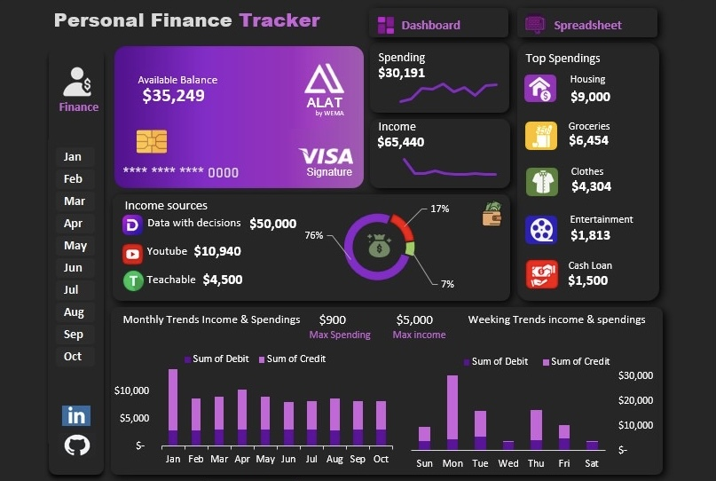

# Personal-Finance-Tracker-
A Personal Finance Tracker built in Excel to monitor income, expenses and savings trends from January to September. Includes KPIs, visual insights and Financial recommendations for smarter budgeting and wealth growth. 
### Check out project

https://medium.com/@phillippatience2018/personal-finance-tracker-using-excel-9eb3c194e084

